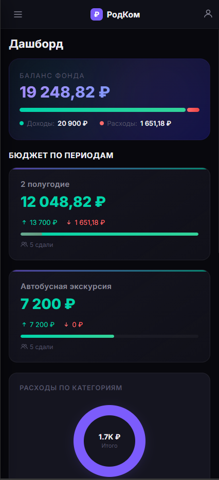
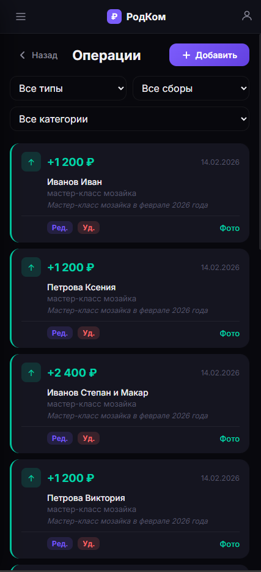
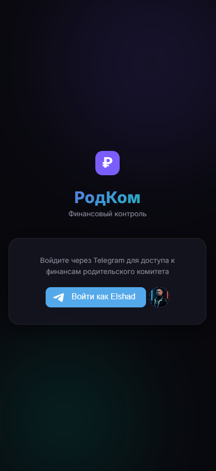

<div align="center">


<br><br>

<h1>РодКом</h1>
<h3>Финансовый контроль родительского комитета</h3>

<p>Telegram-бот + веб-приложение для прозрачного учёта сборов, взносов и расходов.<br>
Каждый родитель видит, сколько собрано и куда потрачено.</p>

</div>

---

## Скриншоты

<!-- Замените ссылки на реальные скриншоты -->

| Дашборд | Операции | Авторизация |
|:-------:|:--------:|:-----------:|
|  |  |  |

---

## Возможности

**Три способа входа через Telegram**
- Telegram Login Widget (на сайте)
- Telegram Mini App (внутри бота)
- Deeplink авторизация через бота

**Финансовый учёт**
- Доходы (взносы) и расходы с привязкой к сборам
- Два типа сборов: **периоды бюджета** (полугодие, четверть) и **целевые** (экскурсии, подарки)
- Загрузка фото чеков и подтверждающих документов
- Дашборд с балансом, категориями расходов и последними операциями

**Управление и безопасность**
- Роли: администратор, казначей, наблюдатель
- Доступ только для участников определённого Telegram-чата
- Журнал аудита всех действий
- Статистика использования и активности

---

## Стек технологий

| Слой | Технологии |
|------|-----------|
| Backend | Python 3.12, FastAPI, SQLAlchemy (async), SQLite |
| Telegram Bot | aiogram 3 |
| Frontend | Vanilla JS + CSS (без фреймворков, SPA) |
| Деплой | Docker, docker-compose |

---

## Быстрый старт

### Docker (рекомендуется)

```bash
# 1. Клонируйте репозиторий
git clone https://github.com/YOUR_USERNAME/rodcom-finance.git
cd rodcom-finance

# 2. Создайте .env из шаблона и заполните
cp .env.example .env

# 3. Подготовьте директорию данных
mkdir -p data

# 4. Запустите
docker compose up -d --build
```

Приложение будет доступно на **http://localhost:8080**

### Без Docker

```bash
python -m venv venv
source venv/bin/activate  # Windows: venv\Scripts\activate
pip install -r requirements.txt
cp .env.example .env
# отредактируйте .env
uvicorn server:app --host 0.0.0.0 --port 8080
```

---

## Переменные окружения

| Переменная | Обязательная | Описание |
|-----------|:---:|----------|
| `BOT_TOKEN` | да | Токен бота от [@BotFather](https://t.me/BotFather) |
| `ADMIN_IDS` | да | Telegram ID администраторов (через запятую) |
| `ALLOWED_CHAT_ID` | да | ID группового чата для проверки членства |
| `SITE_URL` | да | Публичный URL сайта (HTTPS для Mini App) |
| `JWT_SECRET` | да | Секрет для JWT-токенов |
| `BOT_NAME` | да | Username бота без `@` (для Login Widget) |
| `UPLOAD_DIR` | | Папка загрузок (по умолчанию `uploads`) |
| `JWT_EXPIRE_HOURS` | | Время жизни токена, часы (по умолчанию `720`) |

> Сгенерировать `JWT_SECRET`: `python -c "import secrets; print(secrets.token_hex(32))"`

---

## Настройка Telegram-бота

1. Создайте бота через [@BotFather](https://t.me/BotFather)
2. Добавьте бота **администратором** в целевой групповой чат
3. Для Login Widget: `/setdomain` в BotFather — укажите домен сайта
4. Для Mini App: настройте Menu Button в BotFather на URL сайта

---

## Структура проекта

```
.
├── server.py            # FastAPI — API + раздача SPA
├── bot.py               # Инициализация Telegram-бота
├── config.py            # Конфигурация из .env
├── database.py          # SQLAlchemy async engine (SQLite + WAL)
├── models.py            # ORM-модели
├── security.py          # JWT создание / декодирование
├── auth_state.py        # In-memory хранилище auth-сессий
├── states.py            # FSM-состояния бота
├── handlers/
│   └── common.py        # /start, callbacks, deeplink auth
├── middlewares/
│   └── auth.py          # Middleware авторизации бота
├── static/
│   ├── index.html       # SPA — единственная HTML-страница
│   ├── app.js           # Вся клиентская логика
│   └── style.css        # Стили
├── tests/               # Тесты
├── Dockerfile
├── docker-compose.yml
├── requirements.txt
└── .env.example
```

---

## Участие в проекте

1. Откройте [Issue](../../issues) с описанием предложения или бага
2. Дождитесь обсуждения и одобрения
3. Форкните репозиторий и создайте ветку от `main`
4. Отправьте Pull Request с описанием изменений

---

## Лицензия и права

**© 2026 Elshad Guseinov. Все права защищены.**

Проект распространяется по лицензии [CC BY-NC 4.0](LICENSE) (Creative Commons Attribution-NonCommercial 4.0 International).

Вы можете свободно использовать, изучать и модифицировать код в **некоммерческих** целях при условии указания авторства.

**Коммерческое использование запрещено** без письменного согласия автора. По вопросам коммерческого лицензирования обращайтесь через [Issues](../../issues).
